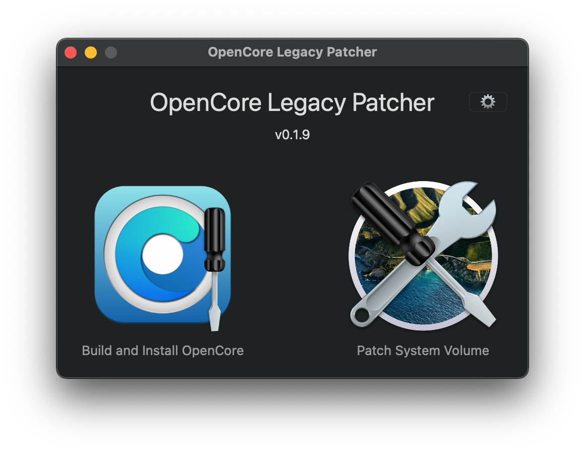

# OpenCore Legacy Patcher Front-End

### DEPRECATED

* Project is now deprecated in favor of wxPython based GUI located in the [core respoitory](https://github.com/dortania/OpenCore-Legacy-Patcher).
  * This repository may still function however no support is provided

Support package for [OpenCore Legacy Patcher](https://github.com/dortania/OpenCore-Legacy-Patcher) providing a GUI interface to the CLI application. 

### Credits

* [dosdude1](https://github.com/dosdude1): Writing and maintaining the GUI
